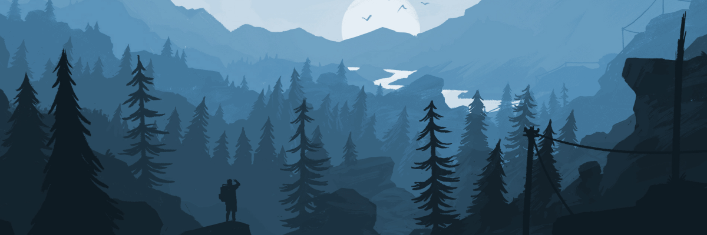

# Hey, I'm Jonathan "Yonte" Larsson 

&nbsp;&nbsp;
&nbsp;&nbsp;
&nbsp;&nbsp;

 

🌱 Born October 26, 2003 in Sweden

🪖 Former military → Now a full-time developer

💻 Working primarily with <strong>.NET</strong>, <strong>C#</strong>, <strong>React</strong> &amp; <strong>TypeScript</strong>

🚀 Driven by building software that people actually enjoy using

🎮 When I'm not coding, you'll probably find me on Steam

 

_Coffee? Nah. Pepsi Max hits different_ 😉☕

## 🛠️ Technologies & Tools

